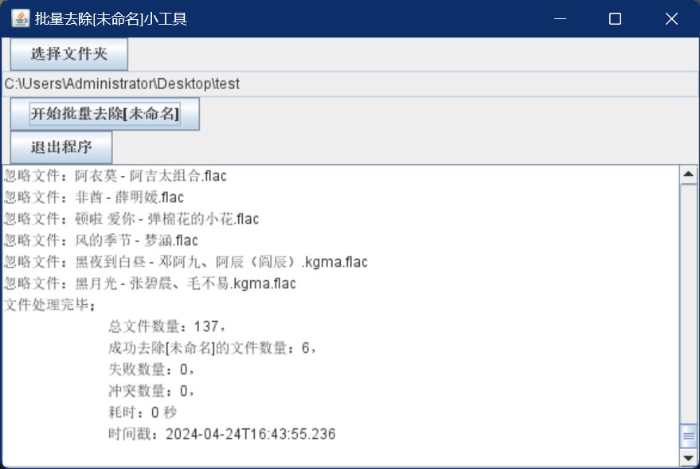

## 先决条件
使用 https://github.com/0x77fe/AudioDecrypt

## 描述  
批量去除文件的[未命名]

## 开始
使用**AudioDecrypt**在某些场景下文件名会出现[未命名]，像这样子：  

  
手动更改太慢，所以临时写了一个小工具，用以批量去除([下载传送门](https://github.com/pengweizhong/rename-gadget/releases))：  
  

## 去除前的效果
  
## 去除后的效果
  

## 另外，推荐两个我常用的音乐播放器  
1、安卓：https://github.com/RetroMusicPlayer/RetroMusicPlayer  
2、PC(WIN)：https://github.com/zhongyang219/MusicPlayer2  